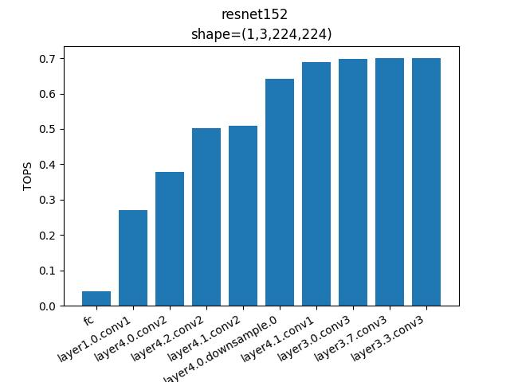
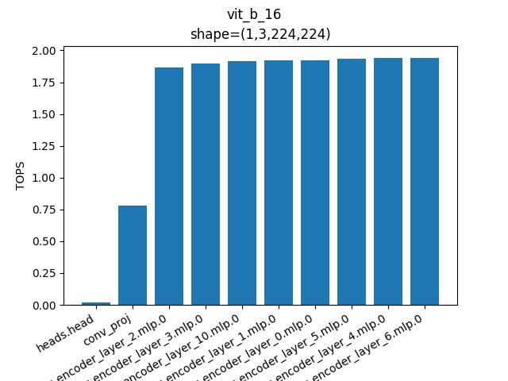
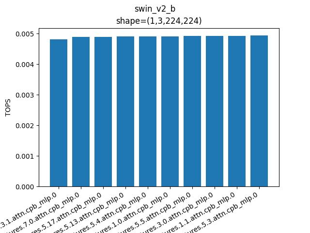

# torchtops(Pytorch TOPS)
[](https://pypi.org/project/torchtops/)

This toolkit evaluate layer level TOPS(Terra Operations Per Second)

these items will be retuned by profile
- layer_name_list (List[str]) - List of layer names
- latency_list (List[float]) - List of latency in miliseconds
- tops_list (List[float]) - List of tops
- modules (List[nn.Module]) - List of nn.Module
- total_flops (int) - total flops of the model

## Quickstart

`pip install torchtops`

```python
import torch
import torchvision
from torchtops import profile, filter_modules

model = torchvision.models.resnet18().cuda().eval()
img = torch.rand([1, 3, 224, 224]).cuda()

res = profile(model, img)

res = filter_modules(res, target_modules=["Conv2d"]) # filter nn.Module you want to get

tops_list, layer_name_list, modules = zip(
        *sorted(zip(res["tops_list"], res["layer_name_list"], res["module_list"]))
    )

for tops, layer_name, module in zip(tops_list, layer_name_list, modules):
        print(f"{tops:.3f}  => {layer_name} : {module}")
```

this results depend on your hardware
```
0.178  => layer4.0.downsample.0 : Conv2d(256, 512, kernel_size=(1, 1), stride=(2, 2), bias=False)
0.179  => layer3.0.downsample.0 : Conv2d(128, 256, kernel_size=(1, 1), stride=(2, 2), bias=False)
0.187  => layer2.0.downsample.0 : Conv2d(64, 128, kernel_size=(1, 1), stride=(2, 2), bias=False)
0.325  => layer4.0.conv1 : Conv2d(256, 512, kernel_size=(3, 3), stride=(2, 2), padding=(1, 1), bias=False)
0.561  => layer4.1.conv2 : Conv2d(512, 512, kernel_size=(3, 3), stride=(1, 1), padding=(1, 1), bias=False)
0.563  => layer4.1.conv1 : Conv2d(512, 512, kernel_size=(3, 3), stride=(1, 1), padding=(1, 1), bias=False)
0.565  => layer4.0.conv2 : Conv2d(512, 512, kernel_size=(3, 3), stride=(1, 1), padding=(1, 1), bias=False)
0.608  => layer3.0.conv1 : Conv2d(128, 256, kernel_size=(3, 3), stride=(2, 2), padding=(1, 1), bias=False)
0.614  => layer2.0.conv1 : Conv2d(64, 128, kernel_size=(3, 3), stride=(2, 2), padding=(1, 1), bias=False)
1.233  => layer3.1.conv2 : Conv2d(256, 256, kernel_size=(3, 3), stride=(1, 1), padding=(1, 1), bias=False)
1.238  => layer3.0.conv2 : Conv2d(256, 256, kernel_size=(3, 3), stride=(1, 1), padding=(1, 1), bias=False)
1.288  => layer3.1.conv1 : Conv2d(256, 256, kernel_size=(3, 3), stride=(1, 1), padding=(1, 1), bias=False)
1.306  => conv1 : Conv2d(3, 64, kernel_size=(7, 7), stride=(2, 2), padding=(3, 3), bias=False)
1.378  => layer2.0.conv2 : Conv2d(128, 128, kernel_size=(3, 3), stride=(1, 1), padding=(1, 1), bias=False)
1.399  => layer2.1.conv1 : Conv2d(128, 128, kernel_size=(3, 3), stride=(1, 1), padding=(1, 1), bias=False)
1.401  => layer2.1.conv2 : Conv2d(128, 128, kernel_size=(3, 3), stride=(1, 1), padding=(1, 1), bias=False)
1.460  => layer1.0.conv1 : Conv2d(64, 64, kernel_size=(3, 3), stride=(1, 1), padding=(1, 1), bias=False)
1.536  => layer1.1.conv2 : Conv2d(64, 64, kernel_size=(3, 3), stride=(1, 1), padding=(1, 1), bias=False)
1.598  => layer1.0.conv2 : Conv2d(64, 64, kernel_size=(3, 3), stride=(1, 1), padding=(1, 1), bias=False)
1.610  => layer1.1.conv1 : Conv2d(64, 64, kernel_size=(3, 3), stride=(1, 1), padding=(1, 1), bias=False)
```

## Plot Results

```
python3.8 tools/example.py
```

### ResNet152


### Vit_b_16


### Swin_v2_b

